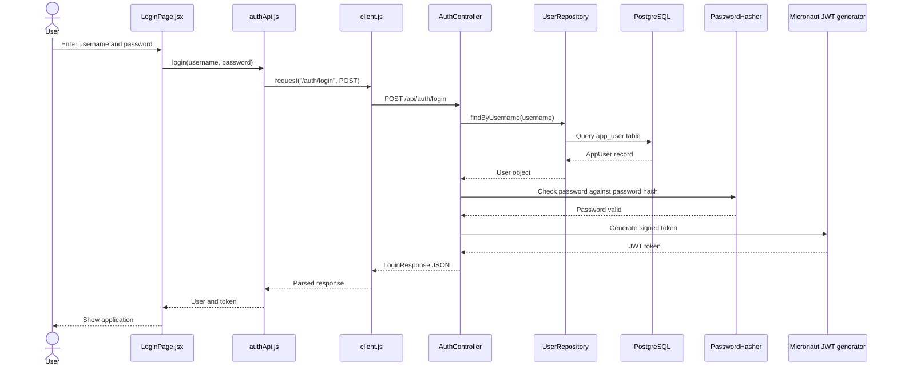
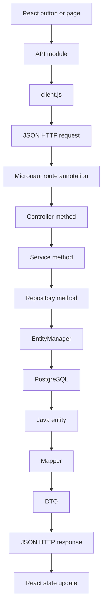
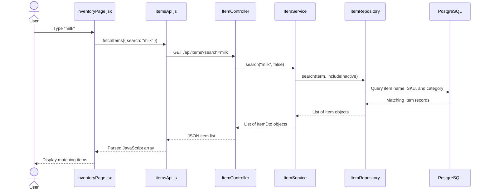
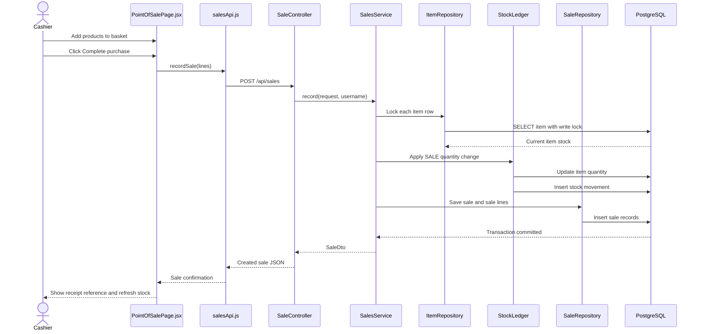
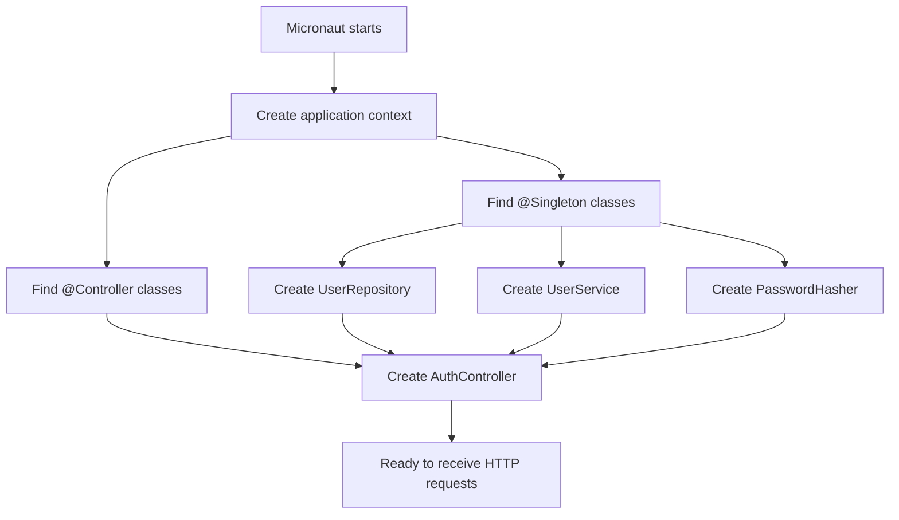
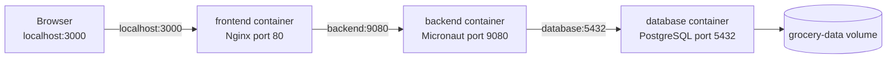
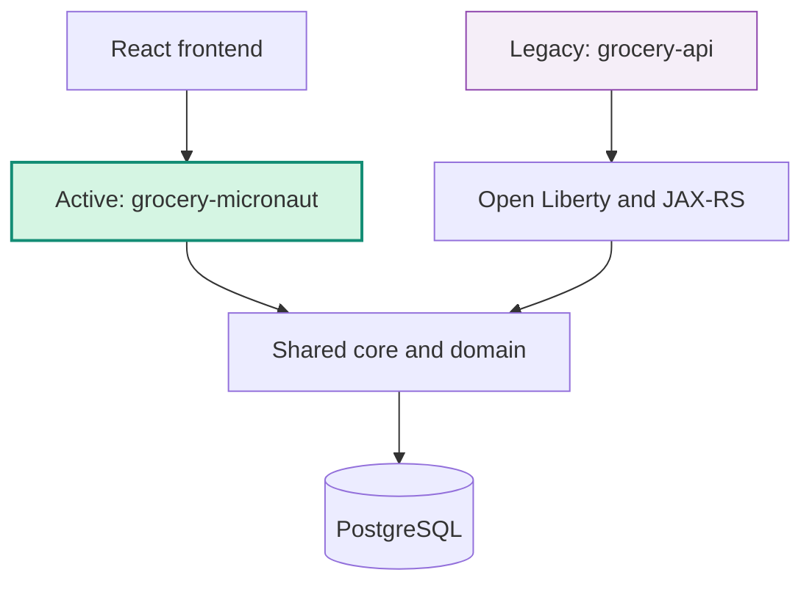

# Grocery Stock Management: Beginner Java and Micronaut Guide

This guide explains how the grocery stock management system works from the browser to the database.

It is written for people learning Java, Micronaut, web APIs, databases, and Docker. It deliberately explains the vocabulary in plain language.

## 1. What the application does

This is a grocery store stock management system. A user can:

- Sign in.
- View the dashboard.
- Search and manage inventory items.
- Adjust stock levels.
- Record sales at the till.
- View sales history.
- Manage users, if they are an administrator.

The application has three major parts:

```text
Frontend in the browser
        |
        | HTTP requests, usually JSON
        v
Micronaut backend
        |
        | database queries
        v
PostgreSQL database
```

### Important abbreviations

The first time an abbreviation appears, its meaning is included here:

- **API** means Application Programming Interface. It is a set of URLs and rules that programs use to communicate.
- **HTTP** means Hypertext Transfer Protocol. It is the protocol used for web requests and responses.
- **JSON** means JavaScript Object Notation. It is a text format commonly used for API data.
- **JVM** means Java Virtual Machine. It runs compiled Java applications.
- **JAR** means Java Archive. It is a packaged Java application or library.
- **JPA** means Jakarta Persistence API. It is a standard Java API for storing Java objects in a database.
- **SQL** means Structured Query Language. It is the language used to query relational databases.
- **JWT** means JSON Web Token. It is a signed text token used to prove that a user is logged in.
- **DTO** means Data Transfer Object. It is an object designed for data sent between systems.
- **URL** means Uniform Resource Locator. It is the address of a web resource.
- **URI** means Uniform Resource Identifier. It is a general identifier for a resource; URLs are one kind of URI.
- **CRUD** means Create, Read, Update, and Delete.
- **JDBC** means Java Database Connectivity. It is the low-level Java API used to connect to databases.
- **CDI** means Contexts and Dependency Injection. It is Jakarta's dependency-injection system.
- **JAX-RS** means Jakarta RESTful Web Services. It is Jakarta's older web API framework used by the legacy code.
- **IDE** means Integrated Development Environment, such as Visual Studio Code.

## 2. The current architecture

The project is in a migration from Open Liberty and JAX-RS to Micronaut.

The active intended path is:

```text
React frontend
  -> Micronaut controller
  -> shared service
  -> shared repository
  -> JPA EntityManager
  -> PostgreSQL
```

The important detail is that this is currently a hybrid migration:

- Micronaut owns the new HTTP server and controllers.
- The existing business services are reused.
- The existing repositories still use JPA `EntityManager` and JPQL.
- Some core classes still use Jakarta CDI annotations.
- The old Open Liberty API module remains in the source tree for reference and compatibility, but the Dockerfile now packages the Micronaut application.

A completely Micronaut-native future version could replace the JPA repositories with Micronaut Data repositories and remove the unused Liberty API module. This guide describes what exists now.

## 3. Repository layout

```text
java-react-example/
|
|-- frontend/                  React and Vite browser application
|-- backend/
|   |-- pom.xml                Maven parent project
|   |-- Dockerfile             Builds and runs the Micronaut backend
|   |-- grocery-contracts/     Request and response data types
|   |-- grocery-domain/        Database entities and enums
|   |-- grocery-core/          Business logic, repositories, mappers, security
|   |-- grocery-api/           Legacy Jakarta EE and Open Liberty API
|   `-- grocery-micronaut/     Micronaut application and controllers
|-- docker-compose.yml         Starts PostgreSQL, backend, and frontend
|-- .env.example               Example local environment settings
|-- README.md                  Short project overview
`-- SYSTEM_GUIDE.md            This teaching guide
```

## 4. Ports and services

A **port** is a numbered network door. Programs listen on ports so other programs can connect to them.

| Service | Container port | Host port | Purpose |
|---|---:|---:|---|
| Frontend | 80 | 3000 | Browser application served by Nginx |
| Micronaut backend | 9080 | 9080 | Java HTTP API |
| PostgreSQL | 5432 | 5432 | Database |

The user opens:

```text
http://localhost:3000
```

The browser calls API paths such as:

```text
http://localhost:3000/api/auth/login
```

During local Vite development, `/api` is proxied to:

```text
http://localhost:9080/api
```

Inside Docker Compose, the backend reaches PostgreSQL using the service name `database`, not `localhost`:

```text
jdbc:postgresql://database:5432/grocery
```

`localhost` inside the backend container would mean the backend container itself. The hostname `database` means the PostgreSQL container.

## 5. Docker Compose: starting the system

File: `docker-compose.yml`

Docker Compose starts multiple containers as one local application.

### Database service

```yaml
database:
  image: postgres:16-alpine
```

This downloads or uses a PostgreSQL 16 image.

PostgreSQL is the relational database. A relational database stores information in tables made of rows and columns.

The environment values create the database account:

```yaml
POSTGRES_DB: grocery
POSTGRES_USER: grocery
POSTGRES_PASSWORD: grocery_local_dev
```

The database is exposed on port `5432`.

The volume keeps database data after the container stops:

```yaml
volumes:
  - grocery-data:/var/lib/postgresql/data
```

A Docker volume is persistent storage managed by Docker.

The health check runs `pg_isready` to confirm that PostgreSQL is ready. The backend waits for this health check before starting.

### Backend service

```yaml
backend:
  build:
    context: ./backend
```

This builds the image using `backend/Dockerfile`.

The backend receives database configuration through environment variables:

```yaml
DB_HOST: database
DB_PORT: "5432"
DB_NAME: grocery
DB_USER: grocery
DB_PASSWORD: grocery_local_dev
```

It also receives the initial administrator settings:

```yaml
SEED_ADMIN_USERNAME: admin
SEED_ADMIN_PASSWORD: Admin123!
```

The backend maps host port `9080` to container port `9080`.

### Frontend service

The frontend is built from `frontend/Dockerfile` and served by Nginx on container port `80`. Docker maps it to host port `3000`.

## 6. Environment variables

File: `.env.example`

An environment variable is a configuration value supplied outside the Java source code.

The example file contains:

```text
DB_NAME=grocery
DB_USER=grocery
DB_PASSWORD=grocery_local_dev
SEED_ADMIN_USERNAME=admin
SEED_ADMIN_PASSWORD=Admin123!
```

The actual `.env` file is normally not committed because passwords and other environment-specific values should not be stored in source control.

Docker Compose reads `.env` automatically when it starts.

## 7. Backend Maven modules

**Maven** is a Java build tool. It downloads libraries, compiles Java files, runs tests, and packages applications.

File: `backend/pom.xml`

This is the parent **POM**, meaning Project Object Model. A POM is Maven's XML build configuration file.

The parent lists these modules:

```text
contracts -> data shapes
 domain   -> database entities
 core     -> business logic
 api      -> legacy Open Liberty application
 micronaut -> active Micronaut application
```

The dependency direction is intended to be:

```text
Micronaut API
  -> core
  -> domain
  -> contracts
```

The Micronaut module also uses `contracts` directly for controller request and response types.

Java release `21` is selected in the parent POM. The application is intended to compile and run on Java 21.

## 8. The Micronaut application module

Directory: `backend/grocery-micronaut/`

This is the new active backend application.

### `GroceryMicronautApplication.java`

Path:

```text
backend/grocery-micronaut/src/main/java/com/ibm/grocery/micronaut/GroceryMicronautApplication.java
```

Important code:

```java
public static void main(String[] args) {
    Micronaut.run(GroceryMicronautApplication.class, args);
}
```

The `main` method is Java's application starting point. It calls Micronaut, which:

1. Creates the application context.
2. Finds controllers and managed beans.
3. Reads configuration.
4. Starts the HTTP server.
5. Opens the application port.

### What is an application context?

The application context is Micronaut's managed collection of application objects.

It knows how to create objects such as:

- Controllers
- Services
- Repositories
- Security components
- Configuration objects

When one object needs another object, Micronaut supplies it through dependency injection.

### `application.yml`

Path:

```text
backend/grocery-micronaut/src/main/resources/application.yml
```

This is the main Micronaut configuration file.

It sets the server port:

```yaml
micronaut:
  server:
    port: 9080
```

It enables bearer-token security:

```yaml
security:
  authentication: bearer
```

A bearer token is a token sent in an HTTP header:

```http
Authorization: Bearer eyJ...
```

It configures JWT token signing using the `JWT_SECRET` environment variable. The default is only for local development and should be replaced in a real deployment.

It configures the database connection:

```yaml
datasources:
  default:
    url: jdbc:postgresql://${DB_HOST:localhost}:${DB_PORT:5432}/${DB_NAME:grocery}
```

The `${NAME:default}` syntax means: use the environment variable if it exists; otherwise use the default value.

The database driver is PostgreSQL's JDBC driver:

```yaml
driver-class-name: org.postgresql.Driver
```

The connection pool can hold up to 20 database connections:

```yaml
maximum-pool-size: 20
```

A connection pool reuses database connections instead of opening a brand-new connection for every request.

The JPA section tells the persistence layer where to find entity classes:

```yaml
jpa:
  default:
    entity-scan:
      packages:
        - com.ibm.grocery.domain
```

The `seed` section supplies the initial administrator credentials to the seed service.

## 9. Micronaut controllers

A controller is a Java class that receives HTTP requests and returns HTTP responses.

Micronaut uses annotations to map URLs to Java methods.

For example:

```java
@Controller("/api/auth")
public class AuthController {

    @Post("/login")
    public LoginResponse login(...) {
        ...
    }
}
```

This maps to:

```text
POST /api/auth/login
```

`POST` is normally used when the client sends data or asks the server to create/change something.

`GET` is normally used to retrieve data.

### `AuthController.java`

Path:

```text
backend/grocery-micronaut/src/main/java/com/ibm/grocery/micronaut/AuthController.java
```

Routes:

```text
POST /api/auth/login
GET  /api/auth/me
```

Login flow:

```text
LoginPage.jsx
  -> authApi.js
  -> client.js
  -> POST /api/auth/login
  -> AuthController.login()
  -> UserRepository.findByUsername()
  -> PasswordHasher.matches()
  -> Micronaut TokenGenerator
  -> LoginResponse
  -> browser stores token
```

The controller receives these dependencies through its constructor:

```java
public AuthController(
        UserRepository userRepository,
        UserService userService,
        PasswordHasher passwordHasher,
        TokenGenerator tokenGenerator)
```

This is constructor injection. It means the class states everything it needs in its constructor.

`@Secured(SecurityRule.IS_ANONYMOUS)` allows login without an existing token.

`@Secured(SecurityRule.IS_AUTHENTICATED)` requires a valid login token.

### `ItemController.java`

Path:

```text
backend/grocery-micronaut/src/main/java/com/ibm/grocery/micronaut/ItemController.java
```

Routes:

```text
GET  /api/items
GET  /api/items/{id}
POST /api/items
PUT  /api/items/{id}
POST /api/items/{id}/activate
POST /api/items/{id}/deactivate
```

The `GET /api/items` route accepts query values:

```text
/api/items?search=milk&includeInactive=true
```

All authenticated roles can read items. Only `ADMIN` and `MANAGER` can create, update, activate, or deactivate items.

`{id}` is a path variable. For example:

```text
/api/items/12
```

means the method receives the number `12` as the item identifier.

### `StockController.java`

Path:

```text
backend/grocery-micronaut/src/main/java/com/ibm/grocery/micronaut/StockController.java
```

Routes:

```text
POST /api/stock/items/{itemId}/movements
GET  /api/stock/movements
```

Managers and administrators can adjust stock. All three roles can view movement history.

The authenticated username is passed to the stock service so the audit record says who performed the movement.

### `SaleController.java`

Path:

```text
backend/grocery-micronaut/src/main/java/com/ibm/grocery/micronaut/SaleController.java
```

Routes:

```text
POST /api/sales
GET  /api/sales
GET  /api/sales/{id}
```

All roles can record a sale. Administrators and managers can view recent sales. All roles can retrieve a specific sale.

The authenticated username is passed to the sales service as `soldBy`.

### `ReportController.java`

Path:

```text
backend/grocery-micronaut/src/main/java/com/ibm/grocery/micronaut/ReportController.java
```

Routes:

```text
GET /api/reports/low-stock
GET /api/reports/dashboard
```

All authenticated roles can view reports.

The report service calculates values such as:

- Number of active items
- Number of low-stock items
- Total units in stock
- Total stock value
- Number of sales today
- Revenue today

### `UserController.java`

Path:

```text
backend/grocery-micronaut/src/main/java/com/ibm/grocery/micronaut/UserController.java
```

Routes:

```text
GET /api/users
POST /api/users
PUT /api/users/{id}
PUT /api/users/{id}/password
```

The entire controller has:

```java
@Secured(Roles.ADMIN)
```

Therefore only administrators can manage users.

### `HealthController.java`

Path:

```text
backend/grocery-micronaut/src/main/java/com/ibm/grocery/micronaut/HealthController.java
```

Route:

```text
GET /micronaut/status
```

It returns:

```json
{
  "framework": "micronaut",
  "status": "running"
}
```

This is a simple proof that the Micronaut server is running.

## 10. What `@Singleton` means

`@Singleton` is a dependency-injection annotation.

Example:

```java
@Singleton
public class UserRepository {
```

It tells Micronaut to create one managed `UserRepository` object per application context and reuse it.

The object relationship is:

```text
Micronaut application context
  -> one UserRepository object
  -> injected into services/controllers that need it
```

It does not mean:

- One database connection forever.
- One request at a time.
- One user in the database.
- Automatically thread-safe code.

It means one reusable Java object managed by Micronaut.

A repository is a good singleton because it does not store information about one particular web request in fields. Request-specific data is passed into methods as parameters.

## 11. Shared core module

Directory: `backend/grocery-core/`

The core module contains business rules and persistence access. Controllers should remain thin and delegate to this module.

### Services

#### `AuthenticationService.java`

Legacy service for the older authentication path. The new Micronaut `AuthController` performs login directly using the user repository, password hasher, and Micronaut token generator.

This service still exists because the old `grocery-api` module remains in the repository.

#### `UserService.java`

Handles user operations:

- List users.
- Find a user by username.
- Create users.
- Update name, role, and active status.
- Reset passwords.
- Prevent an administrator from removing their own administrator access.

It uses:

```text
UserController
  -> UserService
  -> UserRepository
  -> AppUser
```

#### `ItemService.java`

Handles item operations:

- Search items.
- Find one item.
- Create an item.
- Update an item.
- Activate or deactivate an item.
- Prevent duplicate stock keeping units.

A **SKU** means Stock Keeping Unit. It is the product's store identifier, such as `GRO-001`.

#### `StockService.java`

Handles manual stock adjustments.

It:

1. Converts the requested movement text to `StockMovementType`.
2. Rejects sales sent to the stock-adjustment endpoint.
3. Finds and locks the item row.
4. Calls `StockLedger`.
5. Returns an audit DTO.

#### `SalesService.java`

Handles the till sale workflow.

It:

1. Creates a sale reference.
2. Rejects duplicate items in one basket.
3. Locks each item row.
4. Checks and changes stock through `StockLedger`.
5. Creates sale lines.
6. Calculates line totals.
7. Saves the sale.

The method is transactional, so the sale and stock changes succeed together or fail together.

#### `ReportService.java`

Builds dashboard and low-stock responses from repositories.

#### `DataSeedService.java`

Runs during startup and creates data only when needed:

- An administrator when there are no users.
- Starter grocery items when there are no active items.

#### `StockLedger.java`

Centralizes quantity changes and stock movement records. This prevents different features from implementing stock calculations in different ways.

### Repositories

A repository is a class that reads and writes a particular type of stored data.

The repositories currently use JPA's `EntityManager`.

#### `UserRepository.java`

Reads and saves `AppUser` records.

Methods:

- `findByUsername`: case-insensitive username lookup.
- `findById`: lookup by numeric identifier.
- `findAll`: list users alphabetically.
- `count`: count users.
- `save`: insert a new user or merge an existing one.

#### `ItemRepository.java`

Reads and saves `Item` records.

Methods:

- `findById`: find one item.
- `findByIdForUpdate`: lock an item row before changing stock.
- `findBySku`: find an item by SKU.
- `search`: search name, SKU, or category.
- `findLowStock`: find active items at or below reorder level.
- `countActive`: count active items.
- `totalUnitsOnHand`: add quantities.
- `stockValue`: calculate price times quantity.
- `save`: insert or update an item.

The `PESSIMISTIC_WRITE` lock is important for sales. It helps prevent two simultaneous sales from reducing the same stock incorrectly.

#### `StockMovementRepository.java`

Stores stock movement audit records and reads recent movements.

#### `SaleRepository.java`

Stores sales and reads recent sales, sales counts, and revenue totals.

### Mappers

A mapper converts one type of object into another type.

The database entities are internal persistence objects. The API should return DTOs instead of exposing those entities directly.

Mappers include:

- `UserMapper`: `AppUser` to `UserDto`.
- `ItemMapper`: `Item` to `ItemDto`.
- `StockMovementMapper`: `StockMovement` to `StockMovementDto`.
- `SaleMapper`: `Sale` and `SaleLine` to sale DTOs.

## 12. Database domain module

Directory: `backend/grocery-domain/`

The domain module describes the data stored in PostgreSQL.

### `AppUser`

Represents a store user.

Important fields:

- `id`: database identifier.
- `username`: unique login name.
- `fullName`: display name.
- `passwordHash`: one-way password representation.
- `role`: `ADMIN`, `MANAGER`, or `CASHIER`.
- `active`: whether login is allowed.
- `createdAt`: creation timestamp.

### `Item`

Represents a grocery product.

Important fields:

- `sku`: stock keeping unit.
- `name`: product name.
- `category`: product category.
- `unitPrice`: price for one unit.
- `quantityOnHand`: current stock count.
- `reorderLevel`: threshold for low-stock warnings.
- `active`: whether the item is currently sold.
- `version`: optimistic locking value.

The method `isLowStock()` compares quantity with reorder level.

The method `applyQuantityChange()` changes quantity and updates the timestamp.

### `Sale`

Represents a completed sale.

It contains multiple `SaleLine` objects. Adding a line also updates the sale total.

### `SaleLine`

Represents one product entry in a sale.

It stores:

- The product.
- Quantity sold.
- Price at time of sale.
- Total for the line.

Storing the price on the sale line is important because product prices can change later. Old receipts should still show the historical price.

### `StockMovement`

Represents an audit record for a quantity change.

It stores:

- Which item changed.
- Movement type.
- Quantity change.
- Resulting quantity.
- Reference, such as a sale reference.
- Note.
- Username that performed it.
- Timestamp.

### `Role`, `Roles`, and `StockMovementType`

These define allowed role and movement values.

`Roles` contains string constants for security annotations:

```java
Roles.ADMIN
Roles.MANAGER
Roles.CASHIER
```

## 13. Contracts module

Directory: `backend/grocery-contracts/`

Contracts define the shapes of data crossing the HTTP boundary.

A Java `record` is a compact class for data that is mostly immutable.

Examples:

```java
public record LoginRequest(String username, String password) {
}
```

```java
public record LoginResponse(
        String token,
        long expiresInSeconds,
        UserDto user) {
}
```

Important contracts include:

- `LoginRequest`: username and password sent to login.
- `LoginResponse`: JWT, expiration time, and user information.
- `UserDto`: safe user information returned to the browser.
- `ItemRequest`: data used to create or update an item.
- `ItemDto`: item data returned to the browser.
- `StockAdjustmentRequest`: movement type, quantity, and note.
- `StockMovementDto`: stock history data.
- `SaleRequest`: basket lines sent to the server.
- `SaleDto`: completed sale returned by the server.
- `CreateUserRequest`: new user data.
- `UpdateUserRequest`: changed user information.
- `ResetPasswordRequest`: new password data.
- `DashboardSummary`: dashboard totals.
- `LowStockItemDto`: low-stock display data.
- `ApiError`: consistent error response.

Validation annotations such as `@NotBlank` reject invalid input before business logic runs.

## 14. Persistence: how Java reaches PostgreSQL

JPA maps Java classes to database tables.

For example:

```java
@Entity
@Table(name = "app_user")
public class AppUser {
```

This tells the persistence provider that `AppUser` represents the `app_user` table.

The repository receives an `EntityManager`:

```java
@PersistenceContext(unitName = "groceryPU")
private EntityManager entityManager;
```

`EntityManager` is the JPA object that performs database operations.

This query:

```java
entityManager.createQuery(
    "select u from AppUser u where lower(u.username) = lower(:username)",
    AppUser.class)
```

is **JPQL**, meaning Jakarta Persistence Query Language. JPQL queries Java entity names and fields, rather than directly naming database table columns.

The persistence flow is:

```text
UserRepository
  -> EntityManager
  -> JPA provider
  -> JDBC driver
  -> PostgreSQL
```

The PostgreSQL driver translates Java database calls into the network protocol PostgreSQL understands.

## 15. Frontend structure

Directory: `frontend/src/`

The frontend is a React application.

React components are JavaScript functions that return user-interface elements.

### `main.jsx`

This is the browser entry point. It mounts the React application into the HTML page.

### `App.jsx`

Defines browser routes:

```text
/            DashboardPage
/inventory   InventoryPage
/stock       StockPage
/till        PointOfSalePage
/sales       SalesHistoryPage
/users       UsersPage
```

It also decides whether to show the login page or the main application.

### `api/client.js`

This is the shared HTTP client.

Every API path is prefixed with `/api`:

```javascript
fetch(`/api${path}`, ...)
```

It:

1. Reads the JWT from browser `localStorage`.
2. Adds the bearer authorization header.
3. Converts JavaScript objects to JSON.
4. Sends the HTTP request.
5. Parses the JSON response.
6. Throws an `ApiError` when the server returns an error.

### API modules

These files keep network calls out of visual components.

#### `authApi.js`

```text
POST /api/auth/login
GET  /api/auth/me
```

#### `itemsApi.js`

```text
GET  /api/items
POST /api/items
PUT  /api/items/{id}
POST /api/items/{id}/activate
POST /api/items/{id}/deactivate
```

#### `stockApi.js`

```text
POST /api/stock/items/{itemId}/movements
GET  /api/stock/movements
```

#### `salesApi.js`

```text
POST /api/sales
GET  /api/sales
```

#### `reportsApi.js`

```text
GET /api/reports/dashboard
GET /api/reports/low-stock
```

#### `usersApi.js`

```text
GET  /api/users
POST /api/users
PUT  /api/users/{id}
PUT  /api/users/{id}/password
```

### `useAuth.jsx`

This React hook manages login state.

It:

- Stores the current user.
- Checks for an existing token when the application starts.
- Calls `/auth/me` to verify that token.
- Stores a token after successful login.
- Removes the token during logout.
- Provides `hasRole()` for user-interface checks.

Frontend role checks improve the user experience, but they are not the real security boundary. The backend must still enforce roles, and the Micronaut controllers do that with `@Secured`.

### `useApiResource.js`

This reusable hook loads API data and exposes:

- `data`
- `error`
- `loading`
- `reload()`
- `setError()`

Pages use `reload()` after creating or changing data so the screen shows fresh results.

### Shared components

- `Layout.jsx`: common page structure.
- `NavBar.jsx`: navigation links and logout.
- `RequireRole.jsx`: hides or redirects UI routes based on roles.
- `Field.jsx`: reusable form field layout.
- `Message.jsx`: displays errors and success messages.

### Feature pages

#### Authentication

- `LoginPage.jsx`: collects username and password and calls `useAuth().login`.

#### Dashboard

- `DashboardPage.jsx`: loads dashboard and low-stock data.
- `SummaryCards.jsx`: displays totals.
- `LowStockTable.jsx`: displays products needing attention.

#### Inventory

- `InventoryPage.jsx`: search, create, update, activate, and deactivate items.
- `ItemForm.jsx`: item input form.
- `ItemTable.jsx`: item list and actions.

#### Stock

- `StockPage.jsx`: loads items and movement history.
- `StockAdjustmentForm.jsx`: sends a stock adjustment.
- `MovementTable.jsx`: displays recent movements.

#### Sales

- `PointOfSalePage.jsx`: manages a basket and records a sale.
- `BasketEntryForm.jsx`: chooses a product and quantity.
- `BasketTable.jsx`: displays the basket.
- `SalesHistoryPage.jsx`: loads previous sales.

#### Users

- `UsersPage.jsx`: loads and manages users.
- `UserForm.jsx`: creates a user.
- `UserTable.jsx`: changes roles, active status, and passwords.

## 16. Complete login example

A user enters credentials in `LoginPage.jsx`.

```text
1. LoginPage calls useAuth().login.
2. useAuth calls authApi.login.
3. authApi calls client.request("/auth/login").
4. client.request sends POST /api/auth/login.
5. Vite or Nginx forwards the request to port 9080.
6. Micronaut matches AuthController.login.
7. AuthController asks UserRepository for the username.
8. UserRepository queries PostgreSQL.
9. PasswordHasher checks the supplied password.
10. Micronaut creates a signed JWT.
11. LoginResponse returns token and user data.
12. React stores the token in localStorage.
13. Future requests include Authorization: Bearer <token>.
```

The request body is:

```json
{
  "username": "admin",
  "password": "Admin123!"
}
```

A successful response looks conceptually like:

```json
{
  "token": "eyJ...",
  "expiresInSeconds": 28800,
  "user": {
    "id": 1,
    "username": "admin",
    "fullName": "Store Administrator",
    "role": "ADMIN",
    "active": true
  }
}
```

## 17. Complete sale example

```text
1. User adds items in PointOfSalePage.
2. The page calls recordSale(lines).
3. salesApi sends POST /api/sales.
4. SaleController receives the request.
5. SaleController gets the logged-in username from Authentication.
6. SalesService creates a Sale.
7. SalesService locks each Item row.
8. StockLedger checks and changes quantities.
9. StockMovement records each change.
10. SaleLine records the price and quantity.
11. SaleRepository saves the sale.
12. The database transaction commits.
13. The response returns the sale reference.
14. The frontend reloads inventory.
```

If stock is insufficient or a product is missing, the transaction fails. The application should not leave half of the sale saved and half of the stock changed.

## 18. Role permissions

| Operation | ADMIN | MANAGER | CASHIER |
|---|---:|---:|---:|
| Sign in | Yes | Yes | Yes |
| View items | Yes | Yes | Yes |
| Create or update items | Yes | Yes | No |
| Adjust stock | Yes | Yes | No |
| View stock history | Yes | Yes | Yes |
| Record sale | Yes | Yes | Yes |
| View sales history | Yes | Yes | No |
| View reports | Yes | Yes | Yes |
| Manage users | Yes | No | No |

The frontend uses role checks to decide what controls to show. The backend uses Micronaut `@Secured` annotations to enforce the rule even if someone bypasses the frontend.

## 19. Legacy Open Liberty files

The following area is legacy or transitional:

```text
backend/grocery-api/
```

It contains:

- `GroceryApplication.java`
- JAX-RS resource classes such as `AuthResource` and `ItemResource`
- Open Liberty `server.xml`
- MicroProfile configuration
- A WAR, meaning Web Application Archive, build
- Legacy exception mappers

The old path looked like:

```text
Open Liberty
  -> JAX-RS resource
  -> CDI service
  -> JPA repository
```

The new path is:

```text
Micronaut
  -> Micronaut controller
  -> shared service/repository
```

The old files are useful for comparing frameworks, but the current Dockerfile builds `grocery-micronaut` and runs its JAR.

## 20. Backend Dockerfile

Path: `backend/Dockerfile`

The Dockerfile has two stages.

### Build stage

```dockerfile
FROM maven:3.9-eclipse-temurin-21 AS build
```

This image contains Maven and a Java 21 development environment.

The build runs:

```dockerfile
RUN mvn -B -pl grocery-micronaut -am package
```

`-pl` means project list. It selects `grocery-micronaut`.

`-am` means also make. It builds required modules, such as contracts, domain, and core.

### Runtime stage

```dockerfile
FROM eclipse-temurin:21-jre
```

This contains the Java Runtime Environment, meaning the JVM and libraries needed to run the application, but not all development tools.

The packaged JAR is copied into the image:

```dockerfile
COPY ... grocery-micronaut-1.0.0.jar /app/grocery-micronaut.jar
```

The container starts it with:

```dockerfile
ENTRYPOINT ["java", "-jar", "/app/grocery-micronaut.jar"]
```

## 21. Vite development proxy and Nginx production proxy

File: `frontend/vite.config.js`

During Vite development, the frontend runs on port `3000` and proxies `/api` to port `9080`.

The proxy prevents the browser code from needing to hard-code a different backend URL for local development.

The production frontend is served by Nginx. Its configuration is in:

```text
frontend/nginx.conf
```

It forwards API requests to the backend service and serves the React files for other requests.

## 22. How to run the system

From the repository root:

```powershell
docker compose build
docker compose up -d
```

Open:

```text
http://localhost:3000
```

Useful URLs:

```text
http://localhost:9080/micronaut/status
http://localhost:9080/health
```

To see backend logs:

```powershell
docker compose logs -f backend
```

To stop the containers:

```powershell
docker compose down
```

This stops containers but normally preserves the named database volume.

## 23. How to teach this project

A useful teaching order is:

1. Start with the browser and explain a button creates an HTTP request.
2. Show `frontend/src/api/client.js` and explain JSON and headers.
3. Show a Micronaut controller and explain `@Controller`, `@Get`, and `@Post`.
4. Show constructor injection and explain the application context.
5. Show a service and explain business rules.
6. Show a repository and explain database access.
7. Show an entity and explain table mapping.
8. Show `application.yml` and explain configuration.
9. Show Docker Compose and explain separate services and ports.
10. Follow one login or sale request from start to finish.

The most useful single diagram to teach is:

```text
Browser button
  -> React page
  -> API JavaScript module
  -> shared HTTP client
  -> HTTP request
  -> Micronaut controller
  -> Java service
  -> repository
  -> JPA EntityManager
  -> JDBC driver
  -> PostgreSQL table
  -> response DTO
  -> JSON response
  -> React screen update
```

## 24. Current limitations and next migration steps

The project demonstrates Micronaut as the active HTTP runtime, but it is not yet a completely Micronaut-native codebase.

Current hybrid areas:

- Repositories use JPA `EntityManager` instead of Micronaut Data repositories.
- Some services still use Jakarta CDI `@ApplicationScoped` and field injection.
- Some `@Transactional` methods still rely on Jakarta transaction integration.
- The old Open Liberty module remains in the repository.
- The old `AuthenticationService` and `JsonWebTokenIssuer` are still present for the legacy API module.

A future cleanup would:

1. Convert every service to `@Singleton`.
2. Replace field injection with constructor injection.
3. Convert repositories to Micronaut Data JDBC or Micronaut Data JPA.
4. Replace legacy exception mappers with Micronaut exception handlers.
5. Remove the unused Open Liberty module after confirming no compatibility requirement remains.
6. Add focused Micronaut integration tests for login, authorization, stock, and sales.

The important learning point is that framework migration can be incremental. The HTTP layer can move to Micronaut first while the domain and business layers are migrated separately.

## 25. System flow diagram

This diagram shows the main parts of the application and how they communicate.

```mermaid
flowchart LR
  Browser[User browser]
  React[React frontend\nPort 3000]
  Client[frontend/src/api/client.js]
  Micronaut[Micronaut backend\nPort 9080]
  Controller[Micronaut controller]
  Service[Business service]
  Repository[Repository]
  JPA[JPA EntityManager]
  JDBC[JDBC PostgreSQL driver]
  Database[(PostgreSQL\nPort 5432)]

  Browser --> React
  React --> Client
  Client -->|HTTP and JSON| Micronaut
  Micronaut --> Controller
  Controller --> Service
  Service --> Repository
  Repository --> JPA
  JPA --> JDBC
  JDBC --> Database
  Database --> JDBC
  JDBC --> JPA
  JPA --> Repository
  Repository --> Service
  Service --> Controller
  Controller -->|JSON response| Client
  Client --> React
  React --> Browser
```



In simple terms:

1. The user clicks something in the browser.
2. React calls an API module.
3. The API module uses the shared HTTP client.
4. The HTTP request reaches Micronaut on port `9080`.
5. A controller chooses the Java method for the URL.
6. The service applies business rules.
7. The repository reads or changes database data.
8. The response travels back to the browser as JSON.

## 26. Login flow diagram



After login, the browser stores the JWT and sends it on later requests:

```http
Authorization: Bearer <token>
```

## 27. Request and response flow diagram

This is the same process shown as a simpler pipeline.



`DTO` means Data Transfer Object. It is the safe, public shape sent to the frontend. A database entity is kept internal instead of being sent directly to the browser.

## 28. Inventory search flow diagram



## 29. Stock adjustment flow diagram

```mermaid
flowchart TD
  A[Manager submits stock adjustment] --> B[StockAdjustmentForm.jsx]
  B --> C[stockApi.js]
  C --> D[POST /api/stock/items/{itemId}/movements]
  D --> E[StockController]
  E --> F{Is user ADMIN or MANAGER?}
  F -- No --> G[Return authorization error]
  F -- Yes --> H[StockService.adjust]
  H --> I[Find item with row lock]
  I --> J[StockLedger.apply]
  J --> K[Change item quantity]
  J --> L[Create StockMovement audit record]
  K --> M[Database transaction commits]
  L --> M
  M --> N[Return StockMovementDto]
  N --> O[Refresh items and movement history]
```

The row lock matters when two requests try to change the same item at the same time. It helps prevent lost updates and accidental overselling.

## 30. Sale checkout flow diagram



The sale is transactional. A transaction is a group of database changes treated as one unit. If one part fails, the database can roll back the whole operation rather than saving only part of the sale.

## 31. Micronaut dependency injection diagram



`@Singleton` means Micronaut creates one managed object per application context and reuses it. Constructor parameters tell Micronaut which objects a controller needs.

For example:

```java
public AuthController(
    UserRepository userRepository,
    UserService userService,
    PasswordHasher passwordHasher,
    TokenGenerator tokenGenerator) {
  ...
}
```

Micronaut supplies those constructor arguments. The controller does not manually call `new UserRepository()`.

## 32. Docker network diagram



There are two kinds of port references:

- From the host computer, use `localhost`, such as `localhost:3000`.
- Between Docker Compose services, use the service name, such as `database:5432`.

## 33. Legacy and active paths diagram

The repository currently contains both the old and new backend paths.



The Dockerfile currently builds and runs the active Micronaut path:

```text
backend/grocery-micronaut/target/grocery-micronaut-1.0.0.jar
```

The old `grocery-api` code remains in the repository but is not the backend image's entry point.

## 34. Reading each diagram in the code

The diagrams above show the big picture. The sections below connect each box and arrow to the actual files.

### 34.1 System diagram: browser to database

The first diagram can be read from left to right.

#### Browser to React

The browser loads the React application through [main.jsx](frontend/src/main.jsx). React then renders [App.jsx](frontend/src/App.jsx).

Important imports in `App.jsx` include:

```javascript
import { Navigate, Route, Routes } from "react-router-dom";
import Layout from "./components/Layout.jsx";
import LoginPage from "./features/auth/LoginPage.jsx";
import DashboardPage from "./features/dashboard/DashboardPage.jsx";
```

`react-router-dom` supplies browser routing. `Route` connects a browser path such as `/inventory` to a React page.

#### React page to API module

For example, [InventoryPage.jsx](frontend/src/features/inventory/InventoryPage.jsx) imports:

```javascript
import { createItem, fetchItems, setItemActive, updateItem } from "../../api/itemsApi.js";
import { useApiResource } from "../../hooks/useApiResource.js";
```

The page does not construct the URL itself. It calls `fetchItems`, `createItem`, or `updateItem`.

#### API module to shared HTTP client

[itemsApi.js](frontend/src/api/itemsApi.js) imports:

```javascript
import { request } from "./client.js";
```

It supplies the feature-specific path:

```javascript
return request("/items");
```

[client.js](frontend/src/api/client.js) adds the common `/api` prefix, JSON headers, and bearer token:

```javascript
fetch(`/api${path}`, {
    method,
    headers,
    body: ...
});
```

#### HTTP request to Micronaut controller

The request arrives at a controller such as [ItemController.java](backend/grocery-micronaut/src/main/java/com/ibm/grocery/micronaut/ItemController.java).

Important imports include:

```java
import io.micronaut.http.annotation.Controller;
import io.micronaut.http.annotation.Get;
import io.micronaut.http.annotation.Post;
import io.micronaut.security.annotation.Secured;
```

The annotations are the route declarations:

```java
@Controller("/api/items")
@Get
public List<ItemDto> search(...) { ... }
```

#### Controller to service

`ItemController` imports [ItemService](backend/grocery-core/src/main/java/com/ibm/grocery/core/service/ItemService.java) and receives it through its constructor:

```java
private final ItemService itemService;

public ItemController(ItemService itemService) {
    this.itemService = itemService;
}
```

The controller handles HTTP details. The service handles rules such as duplicate SKU checks and item activation.

#### Service to repository

`ItemService` imports [ItemRepository](backend/grocery-core/src/main/java/com/ibm/grocery/core/repository/ItemRepository.java):

```java
import com.ibm.grocery.core.repository.ItemRepository;
```

It calls methods such as:

```java
itemRepository.search(term, includeInactive);
itemRepository.findBySku(request.sku());
itemRepository.save(item);
```

#### Repository to database

`ItemRepository` imports:

```java
import jakarta.persistence.EntityManager;
import jakarta.persistence.PersistenceContext;
```

`EntityManager` is the JPA object used to query and save entities. The repository works with [Item.java](backend/grocery-domain/src/main/java/com/ibm/grocery/domain/Item.java), which is marked with:

```java
@Entity
@Table(name = "item")
```

The persistence configuration is in [application.yml](backend/grocery-micronaut/src/main/resources/application.yml), and the PostgreSQL connection is provided by `docker-compose.yml`.

### 34.2 Login diagram: file-by-file breakdown

The login diagram uses these files in order:

```text
LoginPage.jsx
  -> useAuth.jsx
  -> authApi.js
  -> client.js
  -> AuthController.java
  -> UserRepository.java
  -> AppUser.java
  -> PasswordHasher.java
  -> LoginResponse.java
```

#### `LoginPage.jsx`

Path: [LoginPage.jsx](frontend/src/features/auth/LoginPage.jsx)

Important imports:

```javascript
import { useState } from "react";
import Field from "../../components/Field.jsx";
import Message from "../../components/Message.jsx";
import { useAuth } from "../../hooks/useAuth.jsx";
```

`useState` stores the typed username, password, error, and loading state. `useAuth` provides the login function.

When the form is submitted, it calls:

```javascript
await login(username, password);
```

#### `useAuth.jsx`

Path: [useAuth.jsx](frontend/src/hooks/useAuth.jsx)

Important imports:

```javascript
import { clearToken, storeToken, storedToken } from "../api/client.js";
import { fetchCurrentUser, login as loginRequest } from "../api/authApi.js";
```

After login succeeds:

```javascript
const response = await loginRequest(username, password);
storeToken(response.token);
setUser(response.user);
```

The token is stored in browser `localStorage` by `client.js`.

#### `authApi.js` and `client.js`

Path: [authApi.js](frontend/src/api/authApi.js)

```javascript
export function login(username, password) {
  return request("/auth/login", {
    method: "POST",
    body: { username, password }
  });
}
```

The shared client turns `/auth/login` into `/api/auth/login`.

#### `AuthController.java`

Path: [AuthController.java](backend/grocery-micronaut/src/main/java/com/ibm/grocery/micronaut/AuthController.java)

Important imports:

```java
import io.micronaut.http.annotation.Controller;
import io.micronaut.http.annotation.Post;
import io.micronaut.security.annotation.Secured;
import io.micronaut.security.token.generator.TokenGenerator;
import com.ibm.grocery.core.repository.UserRepository;
import com.ibm.grocery.core.security.PasswordHasher;
```

The controller uses:

```java
@Controller("/api/auth")
@Post("/login")
@Secured(SecurityRule.IS_ANONYMOUS)
```

`IS_ANONYMOUS` means this route can be called before login.

The controller looks up the user, checks the password, creates a Micronaut `Authentication` object, and asks `TokenGenerator` to create a JWT.

#### `UserRepository.java` and `AppUser.java`

`UserRepository` imports [AppUser](backend/grocery-domain/src/main/java/com/ibm/grocery/domain/AppUser.java) and JPA classes:

```java
import com.ibm.grocery.domain.AppUser;
import jakarta.persistence.EntityManager;
import jakarta.persistence.PersistenceContext;
```

The query uses `AppUser` and its Java field `username`. JPA translates that into SQL for the `app_user` table.

#### `PasswordHasher.java`

Path: [PasswordHasher.java](backend/grocery-core/src/main/java/com/ibm/grocery/core/security/PasswordHasher.java)

This class uses Java cryptography imports such as:

```java
import javax.crypto.SecretKeyFactory;
import javax.crypto.spec.PBEKeySpec;
import java.security.MessageDigest;
```

It uses PBKDF2, a password-hashing algorithm. The application compares the entered password with the stored hash instead of storing a plain password.

#### `LoginResponse.java`

Path: [LoginResponse.java](backend/grocery-contracts/src/main/java/com/ibm/grocery/contracts/LoginResponse.java)

This Java record defines the JSON response:

```java
public record LoginResponse(String token, long expiresInSeconds, UserDto user) {
}
```

Micronaut serializes this record into JSON for the browser.

### 34.3 Request and response pipeline: imports at each layer

The general pipeline is represented by these imports and types:

| Layer | File | Main types/imports |
|---|---|---|
| React page | `InventoryPage.jsx` | `useState`, API functions, `useApiResource` |
| API module | `itemsApi.js` | `request` from `client.js` |
| HTTP client | `client.js` | Browser `fetch`, `localStorage` |
| Controller | `ItemController.java` | Micronaut `@Controller`, `@Get`, `@Post`, `@Put` |
| Service | `ItemService.java` | `ItemRepository`, `ItemMapper`, business exceptions |
| Repository | `ItemRepository.java` | JPA `EntityManager`, `TypedQuery` |
| Entity | `Item.java` | JPA `@Entity`, `@Table`, `@Column` |
| DTO | `ItemDto.java` | Java `record`, `BigDecimal` |

The response travels back in the opposite direction:

```text
Entity -> Mapper -> DTO -> Micronaut JSON serialization -> fetch response -> React state
```

### 34.4 Inventory diagram: file-by-file breakdown

The inventory diagram uses:

```text
InventoryPage.jsx
  -> itemsApi.js
  -> client.js
  -> ItemController.java
  -> ItemService.java
  -> ItemRepository.java
  -> ItemMapper.java
  -> ItemDto.java
```

#### Frontend files

[InventoryPage.jsx](frontend/src/features/inventory/InventoryPage.jsx) imports the API functions and child components:

```javascript
import { createItem, fetchItems, setItemActive, updateItem } from "../../api/itemsApi.js";
import { useApiResource } from "../../hooks/useApiResource.js";
import ItemForm from "./ItemForm.jsx";
import ItemTable from "./ItemTable.jsx";
```

`ItemForm` collects item values. `ItemTable` displays the results. `useApiResource` loads and reloads data.

[itemsApi.js](frontend/src/api/itemsApi.js) builds query parameters with `URLSearchParams` and calls `client.js`.

#### Backend files

[ItemController.java](backend/grocery-micronaut/src/main/java/com/ibm/grocery/micronaut/ItemController.java) imports:

```java
import com.ibm.grocery.contracts.ItemDto;
import com.ibm.grocery.contracts.ItemRequest;
import com.ibm.grocery.core.service.ItemService;
import io.micronaut.http.annotation.Controller;
import io.micronaut.http.annotation.Get;
import io.micronaut.http.annotation.Post;
import io.micronaut.http.annotation.Put;
```

It delegates to `ItemService`.

[ItemService.java](backend/grocery-core/src/main/java/com/ibm/grocery/core/service/ItemService.java) imports `ItemRepository`, `ItemMapper`, `Item`, and business exceptions. It checks duplicate SKUs before saving.

[ItemMapper.java](backend/grocery-core/src/main/java/com/ibm/grocery/core/mapper/ItemMapper.java) imports `ItemDto` and `Item`. It copies entity fields into the public response record.

[ItemDto.java](backend/grocery-contracts/src/main/java/com/ibm/grocery/contracts/ItemDto.java) is the response shape used by React.

### 34.5 Stock diagram: file-by-file breakdown

The stock adjustment path is:

```text
StockAdjustmentForm.jsx
  -> StockPage.jsx
  -> stockApi.js
  -> StockController.java
  -> StockService.java
  -> ItemRepository.java
  -> StockLedger.java
  -> StockMovementRepository.java
  -> StockMovement.java
  -> StockMovementDto.java
```

#### Frontend

[StockPage.jsx](frontend/src/features/stock/StockPage.jsx) imports:

```javascript
import { fetchItems } from "../../api/itemsApi.js";
import { adjustStock, fetchMovements } from "../../api/stockApi.js";
import MovementTable from "./MovementTable.jsx";
import StockAdjustmentForm from "./StockAdjustmentForm.jsx";
```

It refreshes both the item list and movement list after a successful adjustment.

[stockApi.js](frontend/src/api/stockApi.js) sends:

```text
POST /api/stock/items/{itemId}/movements
```

#### Backend

[StockController.java](backend/grocery-micronaut/src/main/java/com/ibm/grocery/micronaut/StockController.java) imports `StockService`, `StockAdjustmentRequest`, `StockMovementDto`, and Micronaut security annotations.

It reads the current username from Micronaut `Authentication` and passes that username to the service.

[StockService.java](backend/grocery-core/src/main/java/com/ibm/grocery/core/service/StockService.java) imports:

```java
import com.ibm.grocery.core.repository.ItemRepository;
import com.ibm.grocery.core.repository.StockMovementRepository;
import com.ibm.grocery.domain.StockMovementType;
import jakarta.transaction.Transactional;
```

`@Transactional` means the item update and movement insert are grouped into one database transaction.

[StockLedger.java](backend/grocery-core/src/main/java/com/ibm/grocery/core/service/StockLedger.java) applies the quantity change and creates the audit record.

[StockMovementMapper.java](backend/grocery-core/src/main/java/com/ibm/grocery/core/mapper/StockMovementMapper.java) converts the entity to `StockMovementDto` for the browser.

### 34.6 Sale diagram: file-by-file breakdown

The sale checkout path is:

```text
PointOfSalePage.jsx
  -> BasketEntryForm.jsx and BasketTable.jsx
  -> salesApi.js
  -> SaleController.java
  -> SalesService.java
  -> ItemRepository.java
  -> StockLedger.java
  -> SaleRepository.java
  -> Sale.java and SaleLine.java
  -> SaleMapper.java
  -> SaleDto.java
```

#### Frontend

[PointOfSalePage.jsx](frontend/src/features/sales/PointOfSalePage.jsx) imports:

```javascript
import { fetchItems } from "../../api/itemsApi.js";
import { recordSale } from "../../api/salesApi.js";
import BasketEntryForm from "./BasketEntryForm.jsx";
import BasketTable from "./BasketTable.jsx";
```

The page keeps the basket in React state. It sends only item identifiers and quantities to the server.

[salesApi.js](frontend/src/api/salesApi.js) sends:

```javascript
request("/sales", { method: "POST", body: { lines } });
```

`client.js` changes that into `POST /api/sales`.

#### Backend

[SaleController.java](backend/grocery-micronaut/src/main/java/com/ibm/grocery/micronaut/SaleController.java) imports `SaleRequest`, `SaleDto`, `SalesService`, `Authentication`, and Micronaut route/security annotations.

[SalesService.java](backend/grocery-core/src/main/java/com/ibm/grocery/core/service/SalesService.java) imports:

```java
import com.ibm.grocery.core.repository.ItemRepository;
import com.ibm.grocery.core.repository.SaleRepository;
import com.ibm.grocery.domain.Sale;
import com.ibm.grocery.domain.SaleLine;
import jakarta.transaction.Transactional;
```

It locks items, calls `StockLedger`, builds sale lines, and saves the sale.

[Sale.java](backend/grocery-domain/src/main/java/com/ibm/grocery/domain/Sale.java) imports JPA relationship annotations such as `@OneToMany` and connects a sale to many sale lines.

[SaleLine.java](backend/grocery-domain/src/main/java/com/ibm/grocery/domain/SaleLine.java) connects each line back to its sale and to an item with `@ManyToOne`.

[SaleMapper.java](backend/grocery-core/src/main/java/com/ibm/grocery/core/mapper/SaleMapper.java) converts the entity graph into `SaleDto` and `SaleLineDto` records.

### 34.7 Dependency injection diagram: which annotations matter

The dependency injection diagram is implemented by these pieces.

#### Application startup

[GroceryMicronautApplication.java](backend/grocery-micronaut/src/main/java/com/ibm/grocery/micronaut/GroceryMicronautApplication.java) imports:

```java
import io.micronaut.runtime.Micronaut;
```

`Micronaut.run(...)` creates the application context.

#### Managed classes

Classes marked with `@Singleton` are managed by Micronaut. Examples:

- [UserRepository.java](backend/grocery-core/src/main/java/com/ibm/grocery/core/repository/UserRepository.java)
- [ItemRepository.java](backend/grocery-core/src/main/java/com/ibm/grocery/core/repository/ItemRepository.java)
- [ItemService.java](backend/grocery-core/src/main/java/com/ibm/grocery/core/service/ItemService.java)
- [PasswordHasher.java](backend/grocery-core/src/main/java/com/ibm/grocery/core/security/PasswordHasher.java)

The import is:

```java
import jakarta.inject.Singleton;
```

`Singleton` tells Micronaut to create one reusable managed object per application context.

#### Constructor injection

Controllers use constructor injection:

```java
public ItemController(ItemService itemService) {
    this.itemService = itemService;
}
```

Micronaut sees the `ItemService` type and supplies the matching managed object.

#### Remaining field injection

Some shared services still use the older style:

```java
@Inject
UserRepository userRepository;
```

`@Inject` means the dependency-injection framework supplies the field. It imports:

```java
import jakarta.inject.Inject;
```

The project can be made more consistently Micronaut-style by converting these fields to constructor parameters later.

### 34.8 Docker diagram: file-by-file breakdown

The Docker diagram uses:

```text
docker-compose.yml
  -> frontend/Dockerfile
  -> backend/Dockerfile
  -> PostgreSQL image
```

#### `docker-compose.yml`

Defines service names, ports, environment variables, health checks, dependencies, and the database volume.

The service name `database` becomes a hostname available to the backend container.

#### `backend/Dockerfile`

The build stage uses:

```dockerfile
FROM maven:3.9-eclipse-temurin-21 AS build
```

The runtime stage uses:

```dockerfile
FROM eclipse-temurin:21-jre
```

It runs:

```dockerfile
ENTRYPOINT ["java", "-jar", "/app/grocery-micronaut.jar"]
```

#### `frontend/Dockerfile`

The first stage uses Node.js to build React. The second stage uses Nginx to serve the generated static files.

#### `frontend/vite.config.js`

During Vite development, this import setup is used:

```javascript
import { defineConfig } from "vite";
import react from "@vitejs/plugin-react";
```

The proxy configuration sends `/api` requests to `http://localhost:9080`.

#### `frontend/nginx.conf`

In the containerized frontend, Nginx serves the React files and forwards API traffic to the backend service.

### 34.9 Legacy versus active diagram: file-by-file breakdown

#### Active Micronaut path

```text
grocery-micronaut/GroceryMicronautApplication.java
  -> grocery-micronaut/*Controller.java
  -> grocery-core/*Service.java
  -> grocery-core/*Repository.java
  -> grocery-domain/*.java
```

The active Docker image is built from [backend/Dockerfile](backend/Dockerfile).

#### Legacy Open Liberty path

```text
grocery-api/GroceryApplication.java
  -> grocery-api/resource/*.java
  -> grocery-core/*Service.java
```

The legacy entry point is [GroceryApplication.java](backend/grocery-api/src/main/java/com/ibm/grocery/api/GroceryApplication.java).

It imports Jakarta REST and MicroProfile classes:

```java
import jakarta.ws.rs.ApplicationPath;
import jakarta.ws.rs.core.Application;
import org.eclipse.microprofile.auth.LoginConfig;
```

Legacy resources use imports such as:

```java
import jakarta.ws.rs.GET;
import jakarta.ws.rs.POST;
import jakarta.ws.rs.Path;
import jakarta.annotation.security.RolesAllowed;
```

Micronaut controllers use different imports:

```java
import io.micronaut.http.annotation.Controller;
import io.micronaut.http.annotation.Get;
import io.micronaut.http.annotation.Post;
import io.micronaut.security.annotation.Secured;
```

The two styles may call the same core services, but they are different HTTP frameworks.
